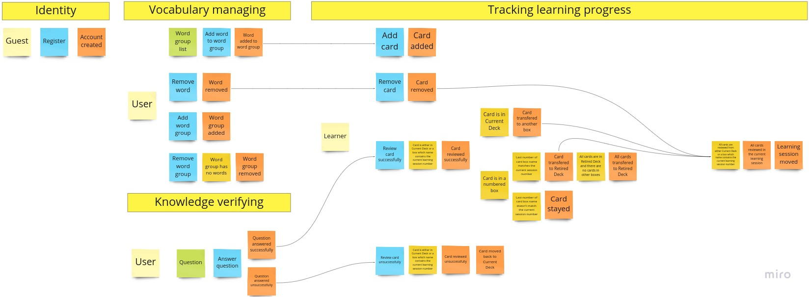

# Voclearn

Application designed for learning foreign language vocabulary based on Leitner System algorithm called Proficiency levels (https://en.wikipedia.org/wiki/Leitner_system).
It was used to defend my thesis at academy (that's why the frontend part is in Polish).

I think that the domain model could be improved a bit so I run an Event Storming session for this project:

The result of the session is not fully reflected in the code yet.
